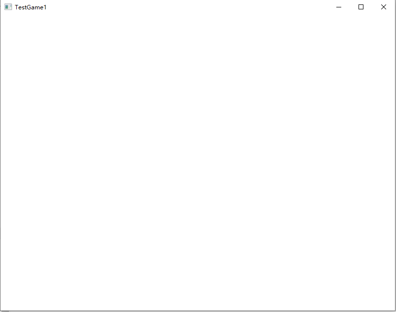
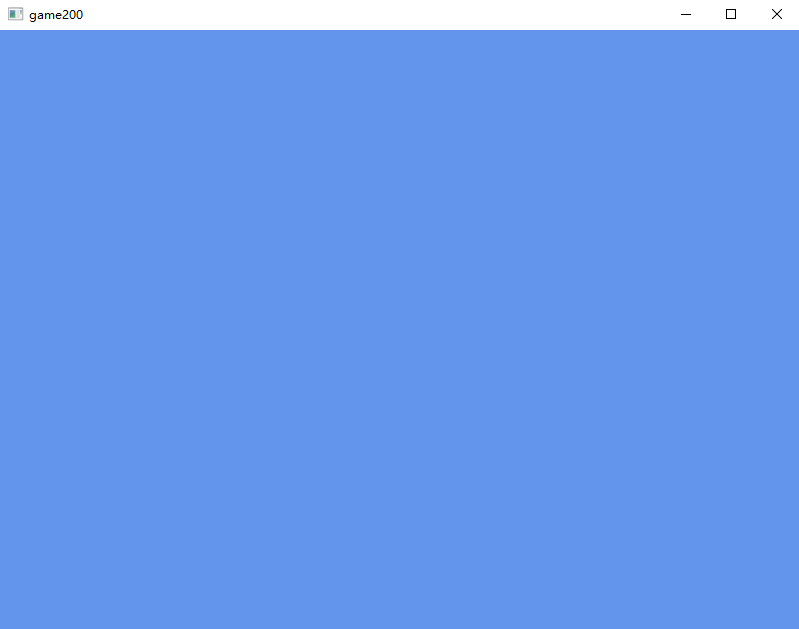
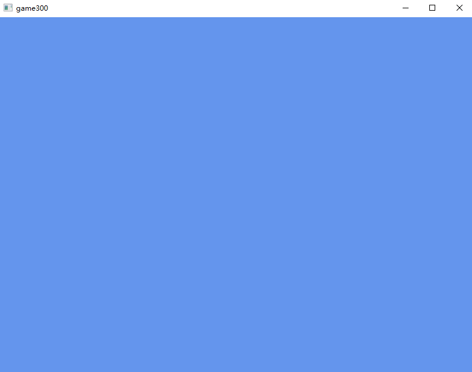
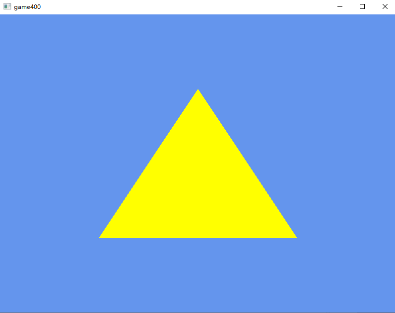
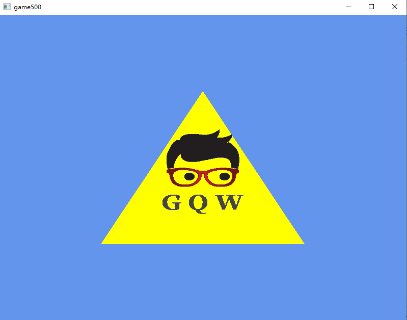
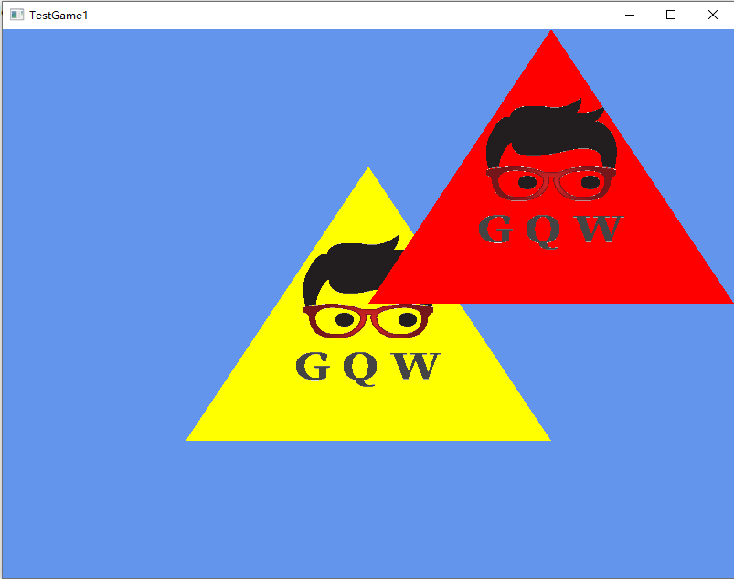
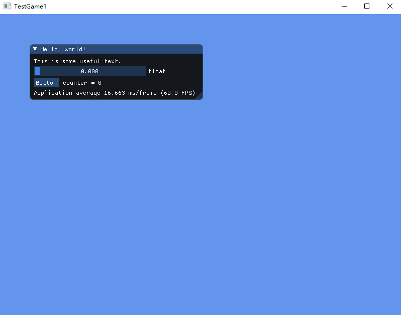
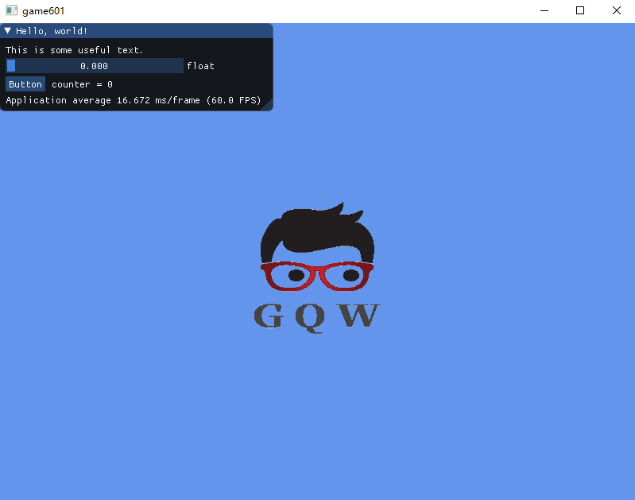
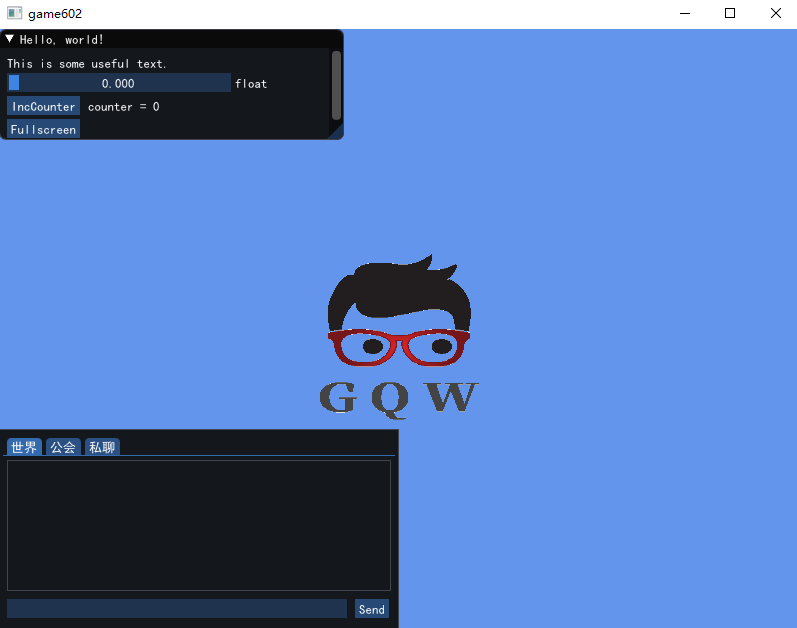

### game100 

实现windows窗口框架

### game200

实现direct3d 11的渲染

### game300

实现独占全屏（fullscreen exclusive）模式

### game400

显示三角形

### game500

显示纹理，使用着色器

### game501

绘制多个图形

### game600

ImGui Demo

### game601

整合ImGui

### game602

使用ImGui，创建聊天框